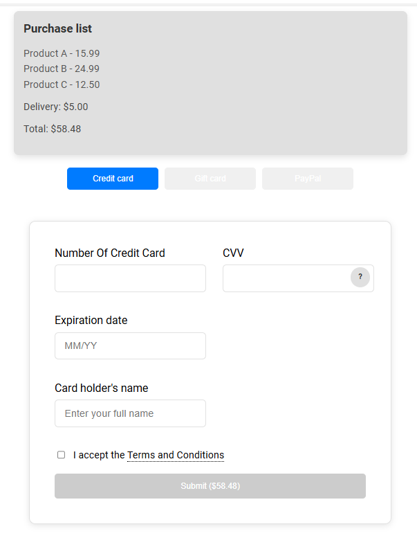

# 💳 Credit Card Payment UI

**Credit Card Payment UI** is a simple and modern application that simulates a credit card payment process. This project demonstrates core React concepts like state management, effects, and context, while delivering a clean and user-friendly design.

---

## 🌟 Features
- 🖼️ **Modern UI**: Stylish interface for entering payment details.
- 🛠️ **Multiple Payment Methods**: Includes tabs for **Credit Card**, **Gift Card**, and **PayPal**.
- ❓ **Interactive Tooltip**: Provides guidance for CVV input.
- 📜 **Terms & Conditions Modal**: Easy access to "Terms and Conditions" with a modal window.
- ✅ **Live Input Validation**: Ensures user inputs are formatted correctly in real-time.
- 📤 **Form Submission**: Simulates payment data submission to a server.

---

## 🚀 How to Run the Project
1. Clone the repository:
   git clone [your-repository-url]

2. Navigate to the project directory:
   cd [your-project-name]

3. Install the required packages:
   npm install

4. Start the development server:
   npm start

By default, the application will run at `http://localhost:3000`.

---

## 🛠️ Technologies Used
- **React**: For building reusable components and managing UI state.
- **CSS Modules**: For scoped and maintainable styling.
- **React Hooks**: For implementing state and effects.

---

## 🤝 Contribution
Feel free to fork this project, submit issues, or create pull requests to contribute!

---

